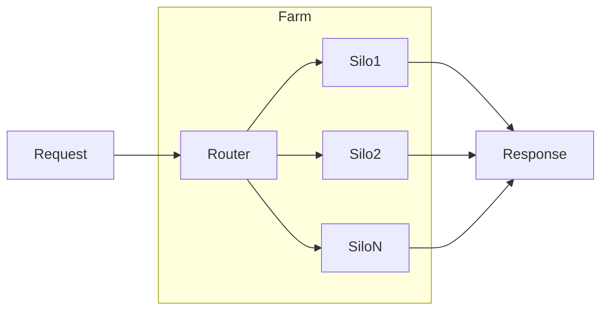

import WIPS from '../../../src/components/Admonitions/_wip_section.mdx';

# What's a Farm?
In dRAGon land, a Farm is a collection of Silos :

:::note
* You can aggregate multiple kind of Silos in a Farm, for example, you can have a Silo for your documents about your products, another Silo for your blog posts (extracted from URLs of a WordPress blog), and another Silo for Frequently Asked Questions (FAQs).
* There is no limit to the number of Silos you can have in a Farm, but you should keep in mind that the more Silos you have, the more time it will take to process the requests.
:::