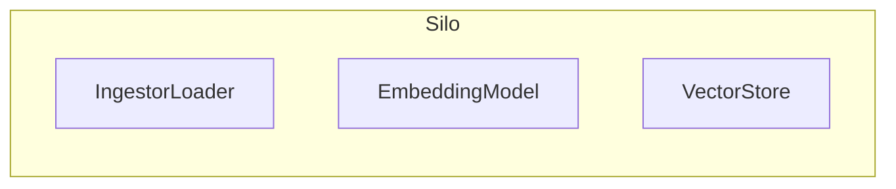
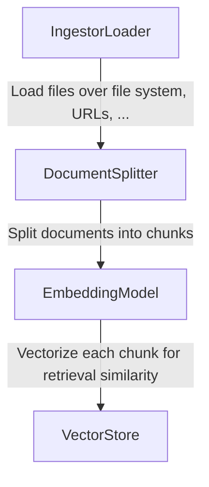

import WIPS from '../../../src/components/Admonitions/_wip_section.mdx';

# What's a Silo?
This entity is designed to store and retrieve chunks, the result of embeddings of documents. It is the basic building block of dRAGon.

A Silo is composed of three main components :

## How does it work?
The Ingestor Loader is responsible for loading the documents into the Silo : it can be done by reading files in a directory or by providing URLs. 
After the documents are loaded they are split into chunks (eg. paragraphs, sentences, etc.) by the Silo Splitter.
Each chunk is then transformed into a vector by the Embedding Model, which is then stored in the Vector Store for later retrieval.
